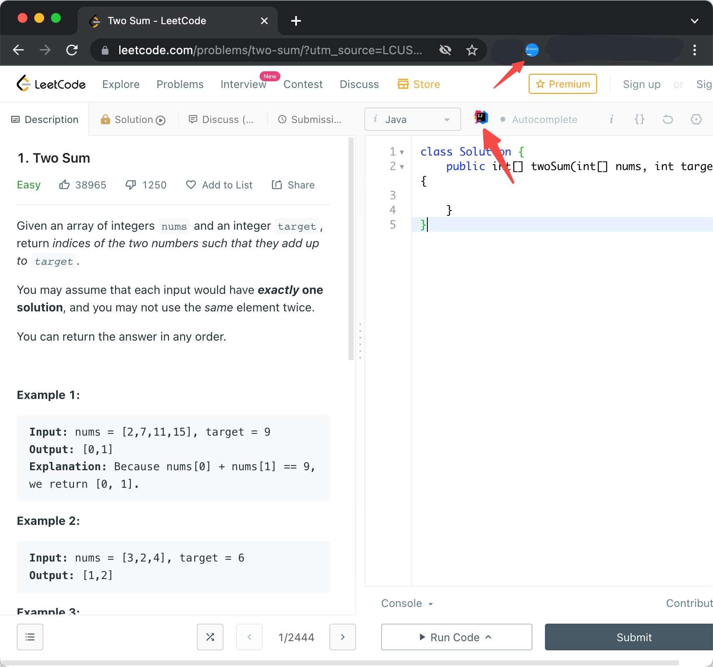

# Leetcode Editoe Extension

- [English Document](README.md)
- [中文文档](#安装方式)

[Leetcode Editor](https://github.com/shuzijun/leetcode-editor)的Chrmoe插件，提供从力扣网页上跳转到IDE编辑器。

## 安装方式

1. 从Chrome商店安装 [链接](https://chrome.google.com/webstore/detail/leetcode-editor-extension/kikcppmgphhkffcdhldclbidggbieegc)
2. 下载文件进行安装

## 使用方式

1. 必须安装[Jetbrains Toolbox App](https://www.jetbrains.com/toolbox-app/),从浏览器跳转IDE需要依赖这个应用提供的协议。
2. 安装[Leetcode Editor](https://github.com/shuzijun/leetcode-editor)插件。
3. 安装本插件，并在选择页面进行配置。
4. 打开leetcode网页,点击图标打开编辑器。
   

## 开发

本插件使用[plasmo](https://github.com/PlasmoHQ/plasmo),相关开发方式参考plasmo
